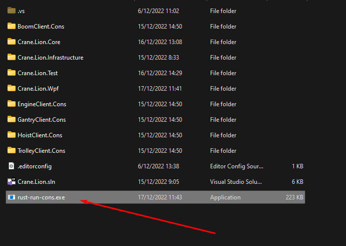
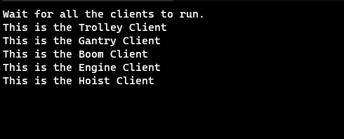

# Rust-Run-Cons

## How to use
download the exe or compile the main.rs file yourself.
then place the exe in the Crane folder like this 
Now run the file and you'll see that it takes a bit of time to fully run. 